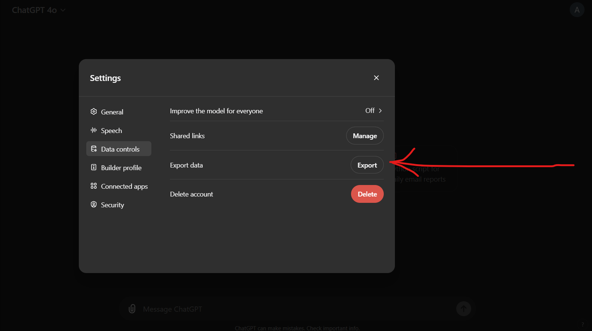

# Motivation
Your ChatGPT conversations hold a wealth of information about your thoughts and ideas, making them a valuable resource for reflecting on your personal development. Revisiting the insights of your younger self can be both enlightening and transformative.

Unfortunately, ChatGPT does not currently provide a built-in search function, nor does it allow sorting or labeling your chats for easy organization.

This project addresses these limitations by making your old GPT chats searchable and manageable in two ways:

Command-Line Search: Quickly find specific information directly from the command line.
Notion Integration: Bulk upload your chats to a Notion database, enabling you to organize, tag, and sort them as needed.


# Data Setup

### 1. Download Your ChatGPT Data
Log into your account at https://chatgpt.com/ and download your




### 2. Position Your ChatGPT Data
Then put the data folder into ```data/raw``` e.g. ```data/raw/b317249d9bfd293ab8aeec43fb616fa6792bbaa639f574d45e0fe65fa89eb9d7-2024-06-24-10-46-26```

### 3. Run
This script searches your ChatGPT chat history for the given search term. Below is a description of each argument, including the default values.
To run the script with the default arguments:

```bash
python main.py
```

| Argument         | Type   | Description                                      | Default Value |
|------------------|--------|--------------------------------------------------|---------------|
| `--search_term`  | `str`  | The keyword to search for in the data            | `"Food"`      |
| `--raw_data_dir` | `str`  | The path to the directory containing the raw data | `"data/raw/b317249d9bfd293ab8aeec43fb616fa6792bbaa639f574d45e0fe65fa89eb9d7-2024-06-24-10-46-26"` |
| `--output_path`  | `str`  | The path to the directory containing the output data | `"outputs/search_results.csv"` |
